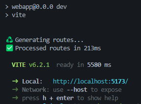

# Hackaton2025

Hackaton 2025 - Educational Bot

## **Prerequisites**

- Python 3.8+
- Git
- Node.js (**>= 18.x**) and npm (**>= 9.x**) installed on your machine
- npm package manager v10.7.0 or later (typically installed with NodeJS)

## **Getting Started**

### 1. Clone the repository on your machine

```bash
# Clone this repository
git clone https://techinnovation.accenture.com/p.a.rodriguez.canedo/hackaton2025-educationalbot.git
cd Hackaton2025-EducationalBot
```

### 2. API Local Setup

#### Install Dependencies

Open a terminal in the root directory and go to `/api` directory:

```bash
cd api
pip install -r requirements.txt
```

#### Environment Variables

Create a `.env` file in the root directory:

```env
LLAMA_API_KEY=
HUGHINGFACE_TOKEN=
AZURE_OPENAI_ENDPOINT=
AZURE_OPENAI_API_KEY=
AZURE_OPENAI_API_VERSION=
AZURE_OPENAI_CHAT_DEPLOYMENT_NAME=
GPT_IMAGES_DEPLOYMENT_NAME=
AZURE_OPENAI_EMBEDDING_DEPLOYMENT_NAME=
GLOBAL_LLM_SERVICE=
CONTAINER=
CONN_STR=
```

#### Run API

Within the `/api` directory execute the following command:

```bash
uvicorn main:app --reload
```

API should be running as long as the terminal is not closed or halted.

### 3. Webapp Local Environment

#### Webapp local setup

1. Open a terminal in the root directory of the cloned repository
2. Navigate to the `/webapp` folder
   `cd webapp`
3. Create a .env file in that folder and add the following variable
   `VITE_API_BASE_URL="http://127.0.0.1:8000"`
4. Install dependencies using npm
   `npm install`
   type "y" or "yes" if terminal asks you for dependency approvals
5. Execute the script to run the app
   `npm run dev`
6. If run successfully, the terminal will show the local URL the app is hosted at
   
